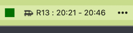

  
<a href="https://github.com/esschul/enturbar/releases/tag/v.1.0.0">Last ned siste versjon her for Apple her.</a>
  

### Takk til <a href="https://developer.entur.org/pages-journeyplanner-journeyplanner">Entur</a> for data ❤️
 
 
Sånn her ser det ut:
 
 

 
 

### Bittelitt teknisk dokumentasjon til de som ønsker å kode på denne hjemme

#### På forkant kan det være greit å ha noe sånt installert:
***Node.js >= 18***

| Script               | Beskrivelse                                                  |
|:---------------------|:-------------------------------------------------------------|
| npm install          | Installer all moroa                                          |
| npm run start        | Kjør EnturBar i utviklingsmodus (starter Electron)           |
| npm run pack-mac     | Bygg og pakk for macOS (`.dmg` og `.zip` som output)         |
| npm run pack-windows | Bygg og pakk for Windows (`.exe` og `.msi` hvis konfigurert) |
| npm run pack-linux   | Bygg og pakk for Linux (`.AppImage`, `.deb`, `.rpm`)         |
